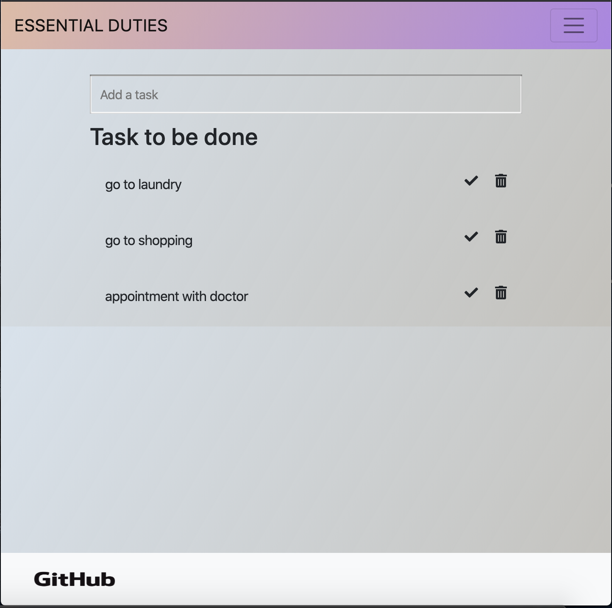
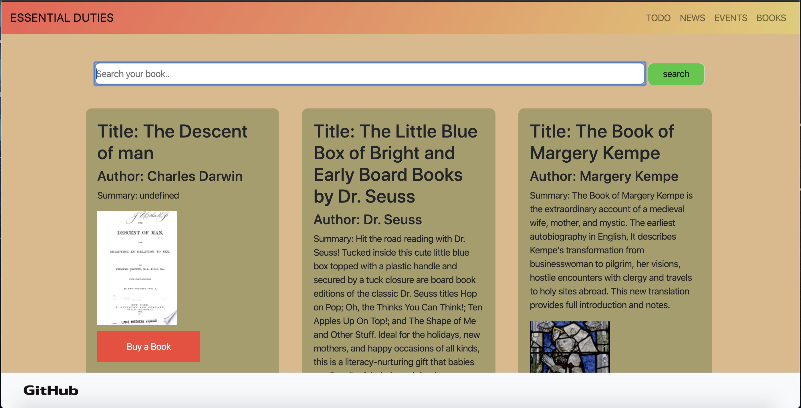
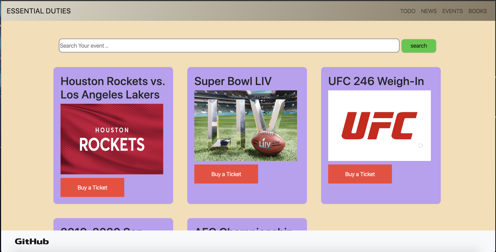

<h1> essentialDuties </h1>
UC Berkeley Extention Coding Bootcamp - Project-1
 
Go to the App : <a href="https://morning-plains-91074.herokuapp.com/home.html" target="_/blank"> essentialDuties </a>

<h2>Overview</h2>
In this project,This app basically a todo with news events and books. We used 3 different API; news, event and books. User can create the todo list, search news, event and books. User can resd the summary of news and books, through events user will get directed to buy a ticket. 

<h2>Technology used</h2>
<ul>
    <li>jQuery and javascript AJAX</li>
    <li>HTML</li>
    <li>CSS</li>
    <li>Bootstrap Framework</li>
    <li>Firebase online storage</li>
</ul>

